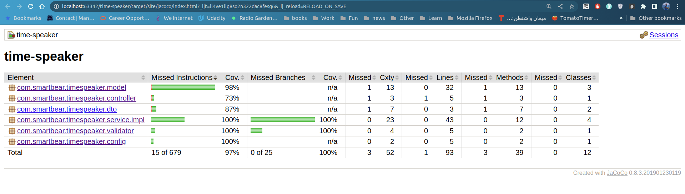
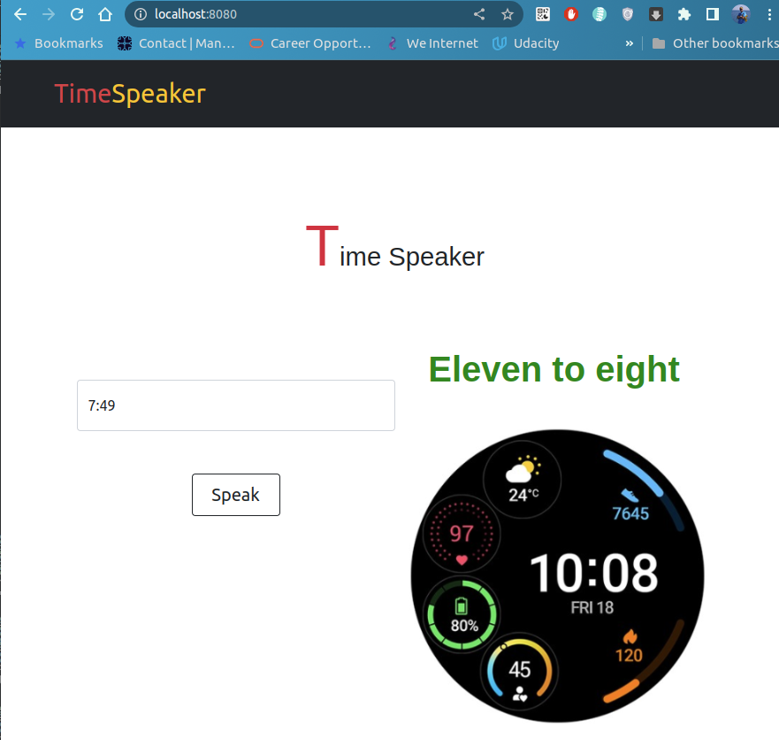
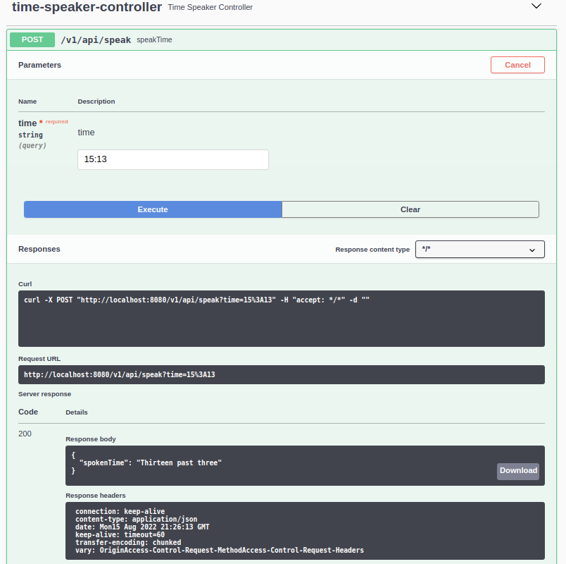

# Timer Speaker Exercise

Is a tool to convert time from number format 'hh:mm' to spoken format like '**2:05**' covert to '**Five past two**'
<br>
Here is more examples

| Time          | Spoken Form               |
| ------------- |:-------------------------:|
| 1:00          | one o'clock               |
| 2:05          | five past two             |
| 3:10          | ten past three            |
| 4:15          | quarter past four         |
| 5:20          | twenty past five          |
| 6:25          | twenty five past six      |
| 6:32          | six thirty two            |
| 7:30          | half past seven           |
| 7:35          | twenty five to eight      |
| 8:40          | twenty to nine            |
| 9:45          | quarter to ten            |
| 10:50         | ten to eleven             |
| 11:55         | five to twelve            |
| 00:00         | midnight                  |
| 12:00         | noon                      |


### Built With
- Java 11
- Spring Boot 2.7.2
- Spring MVC
- Spring AOP
- Lombok
- Junit
- Jacoco code coverage
- Swagger
- Maven

<br>
<h4>Unit Tests coverage</h4>
After building the project the report generated under path

```sh
target/site/jacoco/index.html
```



### Getting Started
To get a local copy up and running please follow these example steps.

####Prerequisites
1. JDK 11 or higher
2. Maven
3. Docker

<br>
Please open a command line (or terminal) and navigate to the folder where you have the
project files (project root directory) <b>time-speaker</b>. then perform the following commands

<br>
Building form source code and generate the jar file

```sh
mvn clean package
```

<br>
Building a docker image 

```sh
docker build -t time-speaker .
```

<br>
Start the image container

```sh
docker run -p 8080:8080 time-speaker
```

<br>
Finally go to 

**[Home Page](http://localhost:8080) (http://localhost:8080)**

<br>


<br>
<br>

**[Swagger Page](http://localhost:8080/swagger-ui/) (http://localhost:8080/swagger-ui/)**

<br>

